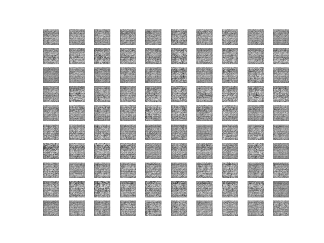

# Car Image Generator based on GAN
## Demo ##
### Image Generation Process for Left Side View of Cars ###

## About ##
The goal of this project is to build a GAN that is capable of creating car images in a realistic way. To do so, the project will follow a [WGAN architecture](https://arxiv.org/abs/1701.07875) and use the data coming from [the car connection webpage](https://www.thecarconnection.com/). The dataset has more than 60,000 images, that will be classified previously into different categories attending to the point of view where the car images has been taken (front, rear, left, etc.). Once the images has been classified, the WGAN architecture uses them in order to generate the new images.
Detailed Explaination: https://marsolmos.com/files/projects/cargen_project.html

## Setup and Requirements ##
### Computer Hardware ###
- OS: Windows 10
- RAM: 16 GB
- CPU: Intel i7-7700 @ 3.6 GHz
- GPU: NVIDIA GeForce GTX 1060 3 GB
- Storage: 256 GB SSD (this repo needs at least 3 GB of space to save all images)

### Requirements ###
1. Python (3.7.10)
2. Tensorflow GPU (2.3.1)
3. Numpy (1.18.5)

## Dataset ##
### [The Car Connection Dataset](https://github.com/nicolas-gervais/predicting-car-price-from-scraped-data/tree/master/picture-scraper) ###
62,500 car images extracted with from [the car connection webpage](https://www.thecarconnection.com/). However, this images are not classified into any categories. To improve the results of the system, we are going to classify previously all the images into categories, depending on the point of view of the image. If the confidence is bigger than 70%, then it classifies the images in the following categories:

- Front
- Front Left
- Front Right
- Rear
- Rear Left
- Rear Right
- Left
- Right (no image was classified into this cateogry with confidence above 70%, so there's no photo belonging to this category)
- Other
- Unknown (for images with confidence threshold under 70%)

To achieve this, an image classifier has been previously trained with 3000 manually labelled images from the original dataset. The code for the training of this model can be found on [classifier/train_model.py](https://github.com/marsolmos/cargen/blob/main/classifier/train_model.py) and the classification script that runs inference on the trained model on [classifier/classify_images.py](https://github.com/marsolmos/cargen/blob/main/classifier/classify_images.py).

## Generating images with WGAN on Tensorflow GPU ##
[WGAN code can be found here](https://github.com/marsolmos/cargen/tree/main/generator)
To train the WGAN, it's important to have images correctly saved into different folders as per the result of the image classifier mentioned in the previous section. Once we have that, we can train the WGAN following the next steps.

1. Set the environment variables in [train_wgan.py](https://github.com/marsolmos/cargen/blob/main/generator/train_wgan.py) according to your needs and paths
2. Correctly set up envirnonment (ensure GPU is available)
3. Run the script [train_wgan.py](https://github.com/marsolmos/cargen/blob/main/generator/train_wgan.py)

In the folder `generator/models/<model_name>/images` you will find the images generated during the training process for that model

## TL; DR ##
The basic steps to follow to use this repo are as follows:
1. Download or clone this repo
2. Install all dependencies in `requirements.txt` in your local environment
3. Download the [car connection dataset](https://github.com/nicolas-gervais/predicting-car-price-from-scraped-data/tree/master/picture-scraper)
4. Train the image classifier with [train_model.py](https://github.com/marsolmos/cargen/blob/main/classifier/train_model.py), as a previous step to train and use WGAN
5. Classify the images with the trained model by running [classifier/classify_images.py](https://github.com/marsolmos/cargen/blob/main/classifier/classify_images.py)
6. Run WGAN image generator with [train_wgan.py](https://github.com/marsolmos/cargen/blob/main/generator/train_wgan.py)

## Acknowledgement ##
- WGAN basic implementation: https://machinelearningmastery.com/how-to-code-a-wasserstein-generative-adversarial-network-wgan-from-scratch/
- The Car Connection Dataset: https://github.com/nicolas-gervais/predicting-car-price-from-scraped-data/tree/master/picture-scraper
- WGAN Paper: https://arxiv.org/abs/1701.07875
- BoolGAN Paper: https://arxiv.org/abs/2006.14380
